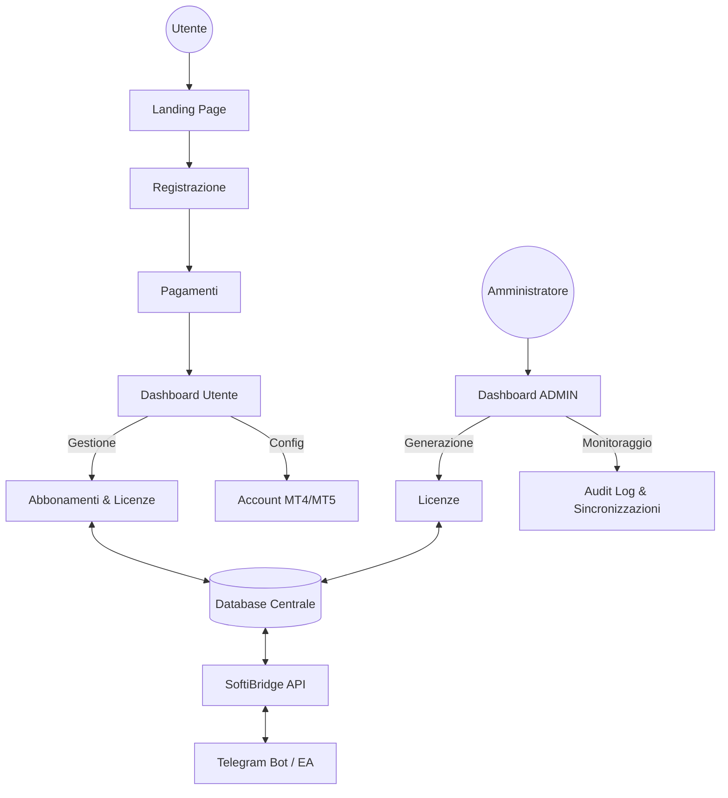

# Progetto SoftiBridge Web Ecosystem: Piano Architetturale

L'obiettivo è trasformare SoftiBridge da un sistema basato su Telegram/CLI a una piattaforma web completa e professionale, mantenendo però la sicurezza e il core engine esistente.

## Visione d'Insieme

Il sistema sarà diviso in due macro-aree:

1. **Public/Client Facing**: Marketing, vendita e gestione utente.
2. **Admin/Back-office**: Controllo totale, monitoraggio e sincronizzazione.

---

## 1. Moduli e Funzionalità

### A. Landing Page (Vetrina & Sales)

- **Hero Section**: Focus sul valore del Bot (automazione, profitto, sicurezza).
- **Pricing Table**: Visualizzazione chiara dei piani (BASIC, PRO, ENTERPRISE) con i limiti (Quote).
- **Call to Action (CTA)**: "Inizia Ora" -> Redirection alla Registrazione.

### B. Dashboard Utente (Management)

- **Stato Abbonamento**: Tipo di piano, data di scadenza, giorni rimanenti.
- **Gestione Licenza**: Visualizzazione della Licenza attiva (da inserire nel client).
- **Limiti & Quote**: Visualizzazione dinamica del consumo (es. 1/3 account collegati).
- **Fatturazione**: Upgrade (es. da BASIC a PRO con calcolo pro-rata), rinnovo manuale/automatico, disdetta.
- **Configurazione**: Input per i numeri di account MT4/MT5 autorizzati (sincronizzati con il database).

### C. Dashboard Admin (Control Center)

- **User Management**: Lista utenti, stato pagamenti.
- **License Engine**: Generazione manuale o visualizzazione di quelle generate automaticamente dal sistema di acquisto.
- **Sync & Logs**: Visualizzazione in tempo reale delle attivazioni (VPS/Install ID).
- **Kill-Switch**: Bottone globale o per singolo utente per revocare licenze istantaneamente.

---

## 2. Integrazione con Sistema Esistente

### Database

Passaggio da SQLite a un database più robusto (PostgreSQL o Firebase) per supportare la gestione web concorrente.

### Flusso della Licenza

1. L'utente paga sul sito.
2. Il sistema genera una licenza (usando `license_core.py`).
3. L'utente la vede in dashboard.
4. L'utente la inserisce nel bot/client Telegram (come avviene ora).

---

## 3. Flusso di Lavoro suggerito per l'AI di Coding

Per far generare questo sistema a un programa AI, useremo i seguenti "Prompt-Master":

1. **Step 1: UI/UX Framework**: Definizione di un design premium (Dark Mode, Glassmorphism) usando Vite/React o Next.js.
2. **Step 2: Backend & Authentication**: Implementazione Clerk o Firebase Auth per la gestione utenti.
3. **Step 3: Database & API Layers**: Esposizione dei dati per le dashboard.
4. **Step 4: Integrazione Stripe/PayPal**: Gestione ricorrenze e webhook per attivazione licenze.

---

## Prossimi Passi (Ragionamento)

> [!IMPORTANT]
> Dobbiamo decidere:
>
> 1. **Metodo di Pagamento**: Stripe è il più semplice per gestire abbonamenti e upgrade pro-rata.
> 2. **Tecnologia**: Preferisci una Single Page App (React/Vite) o una soluzione Full-stack (Next.js)?
> 3. **Hosting**: Dove prevedi di ospitare le Dashboard? (Vercel, VPS esistente, etc.)
